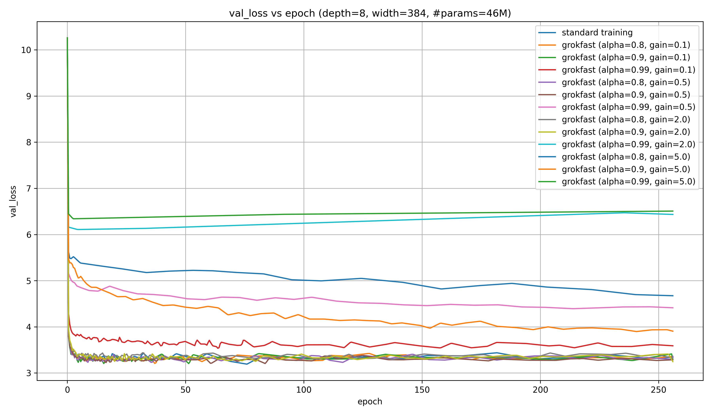
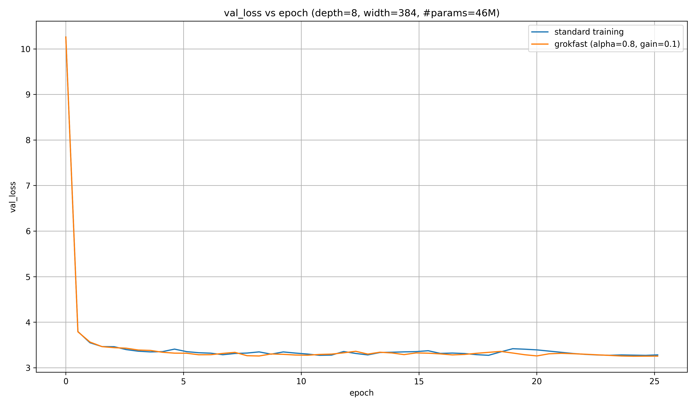
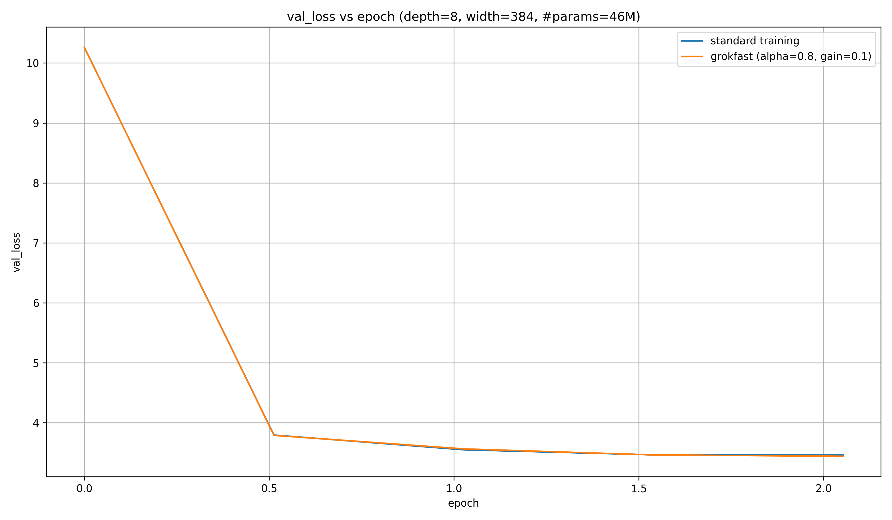

# grokfast

Implementing and testing [$\mathrm{grokfast}$](https://arxiv.org/abs/2405.20233)
for LLMs on small models trained on wikitext.

Quick summary:

- $\mathrm{grokfast}$ doesn't help performance on wikitext, even after $260$ epochs
- It also doesn't hurt performance
- Therefore, it might be helpful for improving performance on algorithmic tasks without hurting it on regular language tasks (though at the cost of an increased memory footprint)

Table of contents:

- [Background](#background)
- [Results](#results)
- [Summary and discussion](#summary-and-discussion)
- [Acknowledgement](#acknowledgement)


## Background

$\mathrm{grokfast}$ works on the assumption that low-frequency parts of gradients carry the most signal.
To make use of this, a low-pass-filter (LPF) will be applied to the gradient, and the result will be added to the original gradient.

There are two hyperparameters: $\alpha$ and $\lambda$; or, as I will call them later, `alpha` and `gain`.

Mathematically, this works like this:

$$
\begin{align}
\bar{\nabla_{\theta}} &= \alpha \cdot \bar{\nabla_{\theta}} + (1 - \alpha) \cdot \nabla_{\theta} \\
\nabla_{\theta} &= \nabla_{\theta} + \lambda \cdot \bar{\nabla_{\theta}}
\end{align}
$$

where $\nabla_{\theta}$ are the gradients with respect to the gradients $\theta$,
and $\bar{\nabla_{\theta}}$ are their exponential moving average (EMA).

Here is how I've implemented it (done before the paper's code was released):

```python
import torch

@torch.no_grad()
def grokfast(net: torch.Module, alpha: float, gain: float):
    for parameter in net.parameters():
        if not hasattr(parameter, "grad_ema"):
            setattr(
                parameter, 
                "grad_ema", 
                torch.empty_like(parameter.grad, dtype=torch.float32).copy_(parameter.grad)
            )  # copy gradients
        else:
            parameter.grad_ema = alpha * parameter.grad_ema + (1 - alpha) * parameter.grad
            parameter.grad += gain * parameter.grad_ema
```

The authors recommend to use $\alpha \in \left[0.8, 0.99\right]$ and $\lambda \in \left[0.1, 5.0\right]$.

They show that $\mathrm{grokfast}$ helps LLMs grok modular addition much faster than regular training, which might transfer to other tasks that can be reduced to simple algorithms, like addition etc.

## Results

Here is an LLM training run without $\mathrm{grokfast}$, compared to the same LLM with the same seed, but for every seeting of $\mathrm{grokfast}$ that I've tried:



Runs where `alpha` and `gain` are high tend to fare worse. To quantify this, here is the average of the $5$ lowest validation losses over $260$ epochs:

| `alpha` | `gain` | $\mathrm{grokfast}$ | Mean of $5$ lowest val losses |
| --- | --- | --- | --- |
| 0.0   | 0.0  | False    | 3.20                   |
| 0.9   | 0.5  | True     | 3.21                   |
| 0.9   | 0.1  | True     | 3.22                   |
| 0.8   | 0.1  | True     | 3.23                   |
| 0.8   | 0.5  | True     | 3.23                   |
| 0.9   | 2.0  | True     | 3.26                   |
| 0.8   | 2.0  | True     | 3.30                   |
| 0.99  | 0.1  | True     | 3.54                   |
| 0.9   | 5.0  | True     | 3.90                   |
| 0.99  | 0.5  | True     | 4.39                   |
| 0.8   | 5.0  | True     | 4.67                   |
| 0.99  | 2.0  | True     | 6.11                   |
| 0.99  | 5.0  | True     | 6.34                   |

Clearly, not using $\mathrm{grokfast}$ seems to be best, but the difference to the next best setting is very small.
The best alternative settings are $\alpha=0.9$, $\lambda=0.5$/$\lambda=0.1$.
These are the least aggressive settings.
I will only plot $\alpha=0.9$, $\lambda=0.1$ from now on.

It's possible that $\mathrm{grokfast}$ does help in early settings,
so let's look at the first ~$25$ epochs:



This doesn't seem to be better in a way that cannot be explained by random noise.
Is it better at all? Let's look at the stats again:

| `alpha` | `gain` | $\mathrm{grokfast}$ | Mean of $5$ lowest val losses |
| --- | --- | --- | --- |
| 0.9   | 0.1  | True     | 3.23                   |
| 0.8   | 0.5  | True     | 3.24                   |
| 0.9   | 0.5  | True     | 3.24                   |
| 0.8   | 0.1  | True     | 3.25                   |
| 0.0   | 0.0  | False    | 3.27                   |
| 0.9   | 2.0  | True     | 3.28                   |
| 0.8   | 2.0  | True     | 3.33                   |
| 0.99  | 0.1  | True     | 3.67                   |
| 0.9   | 5.0  | True     | 4.65                   |
| 0.99  | 0.5  | True     | 4.77                   |
| 0.8   | 5.0  | True     | 5.25                   |
| 0.99  | 2.0  | True     | 6.11                   |
| 0.99  | 5.0  | True     | 6.34                   |

The $\mathrm{grokfast}$ runs do seem to be better than the non-$\mathrm{grokfast}$ ones, but the difference is tiny and can likely be explained by random noise.

Is it any better in the first ~2 epochs?



Again: no. The two runs seem identical. The statistics say the same:

| `alpha` | `gain` | $\mathrm{grokfast}$ | Mean of $5$ lowest val losses |
| --- | --- | --- | --- |
| 0.9   | 0.1  | True     | 4.89                   |
| 0.0   | 0.0  | False    | 4.90                   |
| 0.8   | 0.1  | True     | 4.90                   |
| 0.8   | 0.5  | True     | 4.90                   |
| 0.9   | 0.5  | True     | 4.92                   |
| 0.8   | 2.0  | True     | 5.00                   |
| 0.9   | 2.0  | True     | 5.01                   |
| 0.99  | 0.1  | True     | 5.28                   |
| 0.99  | 0.5  | True     | 6.10                   |
| 0.9   | 5.0  | True     | 6.37                   |
| 0.8   | 5.0  | True     | 6.47                   |
| 0.99  | 2.0  | True     | 6.97                   |
| 0.99  | 5.0  | True     | 7.17                   |

## Summary and discussion

On the one hand, $\mathrm{grokfast}$ doesn't seem to improve the performance of regular LLMs on normal language tasks.

This isn't super surprising; wikitext cannot really be reduced to a simple algorithm, the way that modular addition can, so what would $\mathrm{grokfast}$ be helping with?

On the other hand, $\mathrm{grokfast}$ doesn't seem to *reduce* performance on those regular tasks; so if it does work on modular addition (or similar tasks), it could help improve LLM performance on tasks that can be reduced to algorithms, like addition or multiplication, while keeping performance on other tasks constant.

That seems like a big win!

However, it comes at the cost of having to keep the EMA of the gradients in memory, which is significant.

## Acknowledgement

The $\mathrm{grokfast}$ paper, again: https://arxiv.org/abs/2405.20233

This package is based on my own [hlb-gpt-cli](https://github.com/snimu/hlb-gpt-cli),
which is in turn based on [Fern](https://github.com/tysam-code)'s [hlb-gpt](https://github.com/tysam-code/hlb-gpt),
who can be cited in the following way:

```
cff-version: 1.2.0
message: "Citations would be appreciated if you end up using this tool! I currently go by Fern, no last name given."
authors:
  given-names: "Fern"
title: "hlb-gpt"
version: 0.4.0
date-released: 2023-03-05
url: "https://github.com/tysam-code/hlb-gpt"
```
